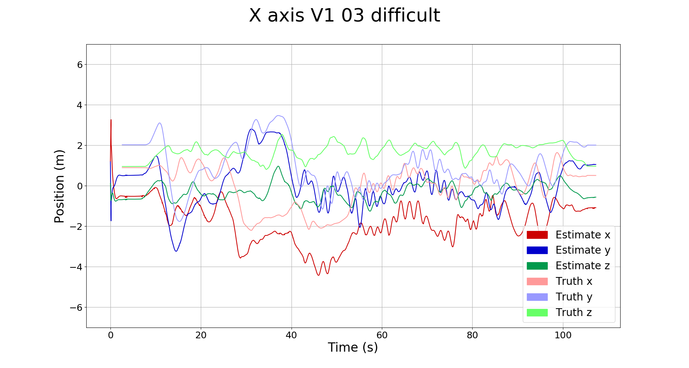

# Installation

Note: Change `~/catkin_ws/MSF_ROVIO_ws` to YOUR_WORKSPACE_DIRECTORY
```
cd ~/catkin_ws/MSF_ROVIO_ws/src
git clone https://github.com/luongmanh1098/MSF_ROVIO.git
cd ..
catkin build rovio --cmake-args -DCMAKE_BUILD_TYPE=Release -DMAKE_SCENE=ON
catkin build
```
This src folder contains: 

msf framework: https://github.com/ethz-asl/ethzasl_msf

rovio (vio algorithm): https://github.com/ethz-asl/rovio

python file for visualize result: https://gitlab.ethz.ch/huberya/msf_plotting_utility

# Run
Base on https://github.com/ethz-asl/ethzasl_msf/wiki/Robust-UAV-State-Estimation

## 2.1. Run MSF+Rovio
Download Dataset from EuroC MAV Dataset: https://projects.asl.ethz.ch/datasets/doku.php?id=kmavvisualinertialdatasets

In this tutorial, we run with Vicon Room 1 03 (Download both ROS BAG and ASL Dataset Format to have full bag file + calibration + groundtruth)

Save Dataset to `YOUR_BAG_FILE` (in this tutorial, dataset is stored at `~/Lab/bag_file/`)

Terminal 1:
```
source YOUR_WORKSPACE_DIRECTORY/devel/setup.bash
roslaunch msf_updates my_pose_sensor_V1_03_difficult_confirmed.launch 
```
(Ctrl+Shift+T) Terminal 2:
```
rosparam set /use_sim_time true
rosrun rqt_reconfigure rqt_reconfigure
```
Inside rqt_reconfigure_Param window, on the left bar, choose myviconpos_sensor, click on init_filter box, and then close this window.

```
rosbag play Lab/bag_file/V1_03_difficult.bag --clock --pause
```

(Ctrl+Shift+T) Terminal 3:
```
cd catkin_ws/MSF_ROVIO_ws/src/msf_plotting_utility/
./record_msf_only.sh 
```

On Terminal 2, press Spacebar to unpause.

Then, your bag file result will be stored in atkin_ws/MSF_ROVIO_ws/src/msf_plotting_utility/recording. Make sure to change your bag result name.

## 2.1. Run MSF+Rovio+GPS

Change file launch to `my_pose_position_sensor_V1_03_difficult_confirmed.launch`, do other command exactly the same as 2.1. Make sure to change your bag result name.

## 2.2. Run Rovio only

Change file launch to `my_rovio_only_V1_03_difficult_confirmed.launch`

Change line `./record_msf_only.sh` to `./record_rovio_only.sh`

do other command exactly the same as 2.1. Make sure to change your bag result name.

# Visualize result

In catkin_ws/src/msf_plotting_utility, we have some python file to visualize result.

File my_pyplot_rosbag_all_with_groundtruth_V1.py will plot estimated x, y, z from bag file result and truth x,y,z from groundtruth csv file (in Dataset downloaded)

Command:
```
cd catkin_ws/src/msf_plotting_utility
python my_pyplot_rosbag_all_with_groundtruth_V1.py ./recordings/_2021-02-25-11-30-46.bag
```
Your result will be like:


File `my_pyplot_rosbag_all_X_axis_V2_confirmed.py`, `my_pyplot_rosbag_all_Y_axis_V2_confirmed.py`, `my_pyplot_rosbag_all_Z_axis_V2_confirmed.py` will plot correspondingly Estimated X/Y/Z value from Rovio only, Rovio+MSF, Rovio+GPS+MSF, and Truth value.

note: Modify all directory to all bag file on these python files before run.

Command:
```
cd catkin_ws/src/msf_plotting_utility
python my_pyplot_rosbag_all_X(/Y/Z)_axis_V2_confirmed.py
```
Your result will be like:


