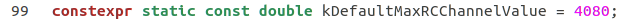
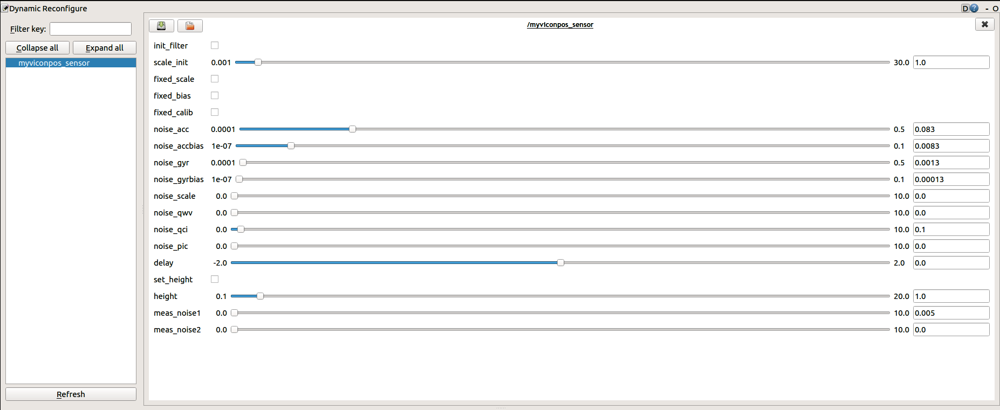

# Installation

## 1. Prerequisites
1.1 **Ubuntu** and **ROS**

Ubuntu  18.04.

ROS Melodic. [ROS Installation](http://wiki.ros.org/ROS/Installation)

Ros package:
 ```
sudo apt-get install ros-melodic-mav-msgs
 ```
## 2. Build on ROS

Note: Change `~/catkin_ws/ssf_ws` to YOUR_SSF_WORKSPACE_DIRECTORY

Clone the repository and catkin build:
```
mkdir -p ~/catkin_ws/ssf_ws/src
cd ~/catkin_ws/ssf_ws/src
git clone https://github.com/ethz-asl/ethzasl_sensor_fusion.git
git clone https://github.com/ethz-asl/asctec_mav_framework.git
git clone https://github.com/catkin/catkin_simple.git
git clone https://github.com/ethz-asl/glog_catkin.git
```
Fix files:
```
gedit ~/catkin_ws/ssf_ws/src/asctec_mav_framework/asctec_hl_interface/src/comm.cpp
```

change line 126 to: `uint32_t diff = abs((int)baudrates[i] - (int)*baudrate);`


```
gedit ~/catkin_ws/ssf_ws/src/asctec_mav_framework/asctec_hl_interface/src/hl_interface.h
```

Change line 99 to: `constexpr static const double kDefaultMaxRCChannelValue = 4080;`



catkin build:
```
cd ~/catkin_ws/ssf_ws
catkin build
```

## 3. Build Viconpos sensor node

Copy [myviconpos_sensor.launch](file/myviconpos_sensor.launch) to `~/catkin_ws/ssf_ws/src/ethzasl_sensor_fusion/ssf_updates/launch`

Rewrite file [main.cpp](file/main.cpp) in: `~/catkin_ws/ssf_ws/src/ethzasl_sensor_fusion/ssf_updates/src`

Copy [myviconpos_measurements.h](file/myviconpos_measurements.h), [myviconpos_sensor.cpp](file/myviconpos_sensor.cpp), [myviconpos_sensor.h](file/myviconpos_sensor.h) to: `~/catkin_ws/ssf_ws/src/ethzasl_sensor_fusion/ssf_updates/src`

Rewrite file [CMakeLists.txt](file/CMakeLists.txt) in: `~/catkin_ws/ssf_ws/src/ethzasl_sensor_fusion/ssf_updates`

Copy file [myviconpos_sensor_fix.yaml](file/myviconpos_sensor_fix.yaml) to: `~/catkin_ws/ssf_ws/src/ethzasl_sensor_fusion/ssf_updates`

Rewrite file [plot_relevant](file/plot_relevant) in `~/catkin_ws/ssf_ws/src/ethzasl_sensor_fusion/ssf_core/scripts`

Rebuild catkin:
```
cd ~/catkin_ws/ssf_ws/
catkin build
```
# Run

Download [dataset.bag](http://wiki.ros.org/ethzasl_sensor_fusion/Tutorials/Introductory%20Tutorial%20for%20Multi-Sensor%20Fusion%20Framework?action=AttachFile&do=view&target=dataset.bag).

Save dataset to `~/catkin_ws/ssf_ws/`

Run:
Terminal 1:
```
cd ~/catkin_ws/ssf_ws
source devel/setup.bash
roslaunch ssf_updates myviconpos_sensor.launch
```
(Ctrl+Shift+T) Terminal 2:
```
source devel/setup.bash #read_note
rosrun rqt_reconfigure rqt_reconfigure
```

Inside rqt_reconfigure_Param window, on the left bar, choose myviconpos_sensor, click on init_filter box


(Ctrl+Shift+T) Terminal 3:
```
source devel/setup.bash #read_note
rosrun ssf_core plot_relevant
```
(Ctrl+Shift+T) Terminal 4:
```
rosbag play dataset.bag --pause -s 25
```
Note: If you run on seprated terminal (instead of subterminal opened by Ctr+Shift+T), you need to source to absolute directory in each terminal:
```
source ~/catkin_ws/ssf_ws/devel/setup.bash
```
On this terminal, press "Spacebar" to unpause. See result in rqt_plot_Plot window

