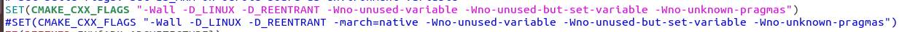

# Installation

Based on [SVO Installation](https://github.com/uzh-rpg/rpg_svo/wiki/Installation:-ROS).
# Installation
Make catkin workspace:
```
    mkdir -p ~/catkin_ws/svo_ws/src
```
Build Sophus:
```
    cd ~/catkin_ws/svo_ws/src
    git clone https://github.com/strasdat/Sophus.git
    cd Sophus/
    git checkout a621ff
    cd sophus
    gedit so2.cpp
```
Change lines:
```
    unit_complex_.real() = 1.;
    unit_complex_.imag() = 0.;
```
to:
```
    unit_complex_ = std::complex<double>(1,0);
```
Save file and build Sophus:
```
    cd ~/catkin_ws/svo_ws/src/Sophus/
    mkdir build
    cd build/
    cmake ..
    make
```
Build SVO:
```
    cd ~/catkin_ws/svo_ws/src
    git clone https://github.com/uzh-rpg/fast.git
    git clone https://github.com/uzh-rpg/rpg_vikit.git
    git clone https://github.com/uzh-rpg/rpg_svo.git
    cd ..
```
Search CMakeLists.txt files in src, remove -march=native in all these CMakeLists.txt files:
```
    src/rpg_svo/svo/CMakeLists.txt
    src/rpg_svo/svo_ros/CMakeLists.txt
    src/rpg_vikit/vikit_common/CMakeLists.txt
    src/rpg_vikit/vikit_ros/CMakeLists.txt
```
Example: 

Finally, build SVO:
```
cd ~/catkin_ws/svo_ws
catkin build
```
## 3. Build Error

