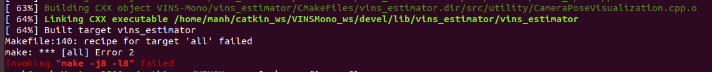

# Installation

Based on [VINSMono Installation](https://github.com/HKUST-Aerial-Robotics/VINS-Mono).
## 1. Prerequisites
1.1 **Ubuntu** and **ROS**
Ubuntu  18.04.
ROS Melodic. [ROS Installation](http://wiki.ros.org/ROS/Installation)

Additional ROS pacakge
```
    sudo apt-get install ros-melodic-cv-bridge ros-melodic-tf ros-melodic-message-filters ros-melodic-image-transport
```

1.2. **Ceres Solver**
Follow [Ceres Installation](http://ceres-solver.org/installation.html)
```
    sudo apt-get install cmake libgoogle-glog-dev libatlas-base-dev libeigen3-dev libsuitesparse-dev
    mkdir -p ~/catkin_ws
    cd ~/catkin_ws
    git clone https://ceres-solver.googlesource.com/ceres-solver
    cd ceres-solver/
    mkdir build
    cd build
    cmake ..
    make -j8
    sudo make install
```

## 2. Build on ROS
Clone the repository and catkin_make:
```
    mkdir -p ~/catkin_ws/VINSMono_ws/src
    cd ~/catkin_ws/VINSMono_ws/src/
    git clone https://github.com/HKUST-Aerial-Robotics/VINS-Mono.git
    cd ..
    catkin_make
```
## 3. Build Error

Close all unnecessary applications.
# Run

## 1. Run VINSMono with EuRoC MAV Dataset

Download [EuRoC MAV Dataset](http://projects.asl.ethz.ch/datasets/doku.php?id=kmavvisualinertialdatasets).

Open three terminals, launch the vins_estimator , rviz and play the bag file respectively. Take MH_01 for example
```
    source catkin_ws/VINSMono_ws/devel/setup.bash 
    roslaunch vins_estimator euroc.launch
```
```
    source catkin_ws/VINSMono_ws/devel/setup.bash
    roslaunch vins_estimator vins_rviz.launch
```
```
    rosbag play YOUR_BAG_DIR/MH_01_easy.bag 
```
## 2. Run VINSMono with Realtime Data

**2.1 Setup sensor**

Hardware:
- Laptop Corei5
- Mono Camera: Intel® RealSense™ Depth Camera D435 (using rgb camera at grayscale topic, 30Hz, see **2.2**)
- IMU Sensor: PX4 (150Hz, see [update_rate_imu.md](https://github.com/luongmanh1098/drone-coordinator/blob/sprint_2020-11-14/sensors/update_rate_imu.md) if you want to update your px4 imu rate)

Ros package:
- Install [mavros](https://github.com/mavlink/mavros)
- Install [realsense-ros](https://github.com/IntelRealSense/realsense-ros)

Setup:
```
    cd ~/catkin_ws/VINSMono_ws/src/VINS-Mono/config
    mkdir my_config
```
Add [my_live_config.yaml](my_live_config.yaml) and [my_live_config_no_extrinsic.yaml](my_live_config_no_extrinsic.yaml) here.
```
    cd ~/catkin_ws/VINSMono_ws/src/VINS-Mono/vins_estimator/launch
```

Add [my_live.launch](my_live.launch) and [my_live_no_extrinsic_param.launch](my_live_no_extrinsic_param.launch) here.

 **2.2 Run with extrinsic parameter**
 
 Get mono grayscale image topic using image_proc:
```
    roslaunch realsense2_camera rs_camera.launch 
    ROS_NAMESPACE=camera/color rosrun image_proc image_proc
```
Now, you have image topic: /camera/color/image_mono.

Get imu topic from px4:
```
    roslaunch mavros px4.launch
```
Launch rviz and vins_estimator:

```
    source catkin_ws/VINSMono_ws/devel/setup.bash 
    roslaunch vins_estimator vins_rviz.launch
```
```
    source catkin_ws/VINSMono_ws/devel/setup.bash 
    roslaunch vins_estimator my_live.launch
```
 **2.2 Run without extrinsic parameter**
 
 Replace the last line with:
```
    roslaunch vins_estimator my_live_no_extrinsic_param.launch
```
After, you need to move your MAV slowly in varies way (roll, pitch, yaw) to calibration online.


